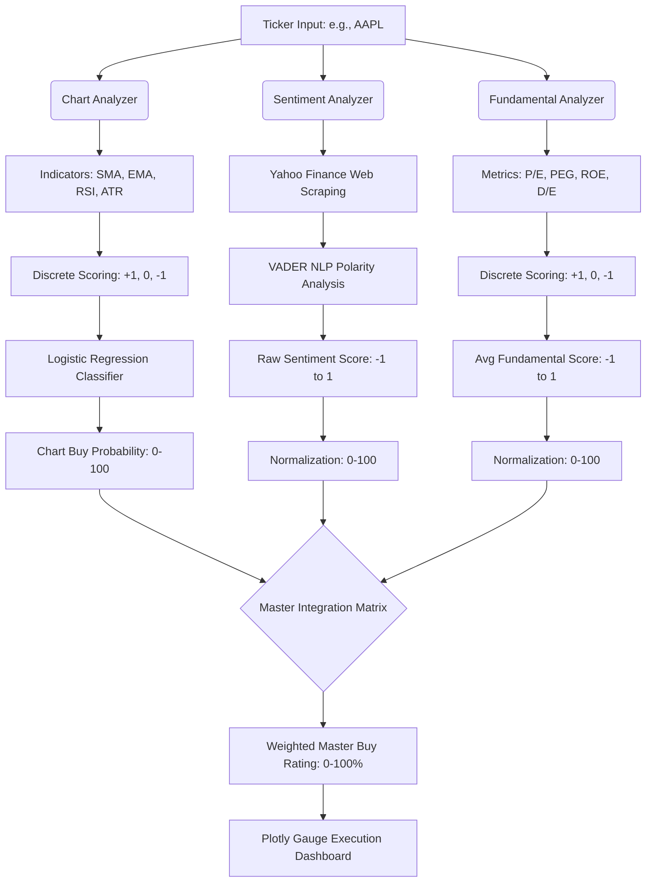

# 📈 Algorithmic Stock Rating & Trading Execution Engine

[](https://www.python.org/downloads/)
[](https://jupyter.org/)
[](https://opensource.org/licenses/MIT)

> **Live Interactive Environment:** [Launch Quantitative Pipeline in Google Colab](https://colab.research.google.com/github/harjasjolly-create/algorithmic-stock-rating-program/blob/main/hypothesis_verifier.ipynb)

## 📌 Executive Summary
A systematic, multi-factor trading pipeline currently calibrated for single-asset evaluation (e.g., AAPL). The engine eliminates human bias by synthesizing machine learning-driven technical momentum, fundamental valuation scoring, and Natural Language Processing (NLP) sentiment analysis into a fully automated, weighted $0\text{--}100$ execution signal.

---

## 🏛️ System Architecture & Logic Flow

The pipeline bypasses single-factor failure by aggregating three independent analytical domains. The data flow architecture is mapped below:


# 🔬 Sub-Model Methodologies
1. **Technical Classifier (Chart Analyzer)**
A Machine Learning model optimized to predict short-term momentum.
Feature Engineering: Computes Relative Strength Index (RSI), Simple/Exponential Moving Averages (SMA/EMA), and utilizes Average True Range (ATR) to define structural support and resistance bounds.
Heuristic Scoring: Raw indicators are mapped to discrete tensors $[−1,0,1]$.
ML Probability Mapping: A Logistic Regression model dynamically weights the discrete scores to output a continuous $Chart Buy Probability$ bounded between 0 and 100.
2. **Fundamental Valuation Matrix**
An automated extraction mechanism that evaluates underlying corporate health against historically backtested baseline thresholds.
Metrics Extracted: Trailing Price-to-Earnings (P/E), PEG Ratio, Return on Equity (ROE), and Debt-to-Equity (D/E).
Scoring Logic: Ratios are scored into $[−1,0,1]$ arrays and averaged to create a composite fundamental baseline.
3. **NLP Market Sentiment Pipeline**
Real-time financial news headlines are scraped using BeautifulSoup and processed via a VADER NLP lexicon. The algorithm extracts semantic polarity (positive, negative, neutral) to generate a raw score representing short-term institutional sentiment.

# ---

# 🧮 Signal Normalization & Mathematical Synthesis
The core engineering challenge of this pipeline is reconciling the heterogeneous outputs of the three sub-models. To resolve dimensional mismatch, the engine applies a mathematical transformation to map the Fundamental and Sentiment $[-1, 1]$ feature vectors onto a continuous $[0, 100]$ interval:
* **Normalization Formula:** `Score_norm = ((Score_raw + 1) / 2) * 100`

Once all three pillars are normalized to a base-100 scale, the integration matrix applies a predefined institutional weighting vector to compute the final score:
$\text{Master Rating} = (W_T \times P_T) + (W_F \times P_F) + (W_S \times P_S)$

(Where W represents the assigned weight and P represents the normalized probability/score for the Technical, Fundamental, and Sentiment pillars).

# ---

# 📊 Dashboard Visualization
A static rendering of the probabilistic Master Rating gauge. For the interactive hover-state dashboard, please launch the Colab environment.
# 🚀 Installation & Local Execution
# 1.Clone the repository
```bash
git clone [https://github.com/harjasjolly-create/algorithmic-stock-rating-program.git](https://github.com/harjasjolly-create/algorithmic-stock-rating-program.git)
cd algorithmic-stock-rating-program
```
# 2. Install Dependencies
```bash
pip install pandas numpy scikit-learn yfinance vaderSentiment plotly kaleido beautifulsoup4
```
# 3. Launch the Engine
```bash
jupyter notebook hypothesis_verifier.ipynb
```
